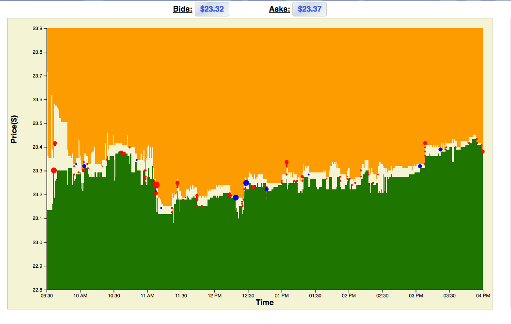
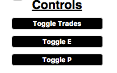

# Stocker

## Overview

Stocker is an app which uses JavaScript, jQuery, and D3 in order to visualize stock information. Bid amounts are represented by the green area starting from the bottom of the graph and Ask amounts are represented by the orange area. Trades of type E are represented as red circle and trades of type P are represented by blue circles. The radius of the circle is proportional by the number of shares which exchanged hands in the trade.

## Controls

The trade size slider will allow the user to increase the size of trades up to 2x for greater visibility.

Trades can be turned off with the Toggle Trades button. Buttons are also available which turn off trades by type.

